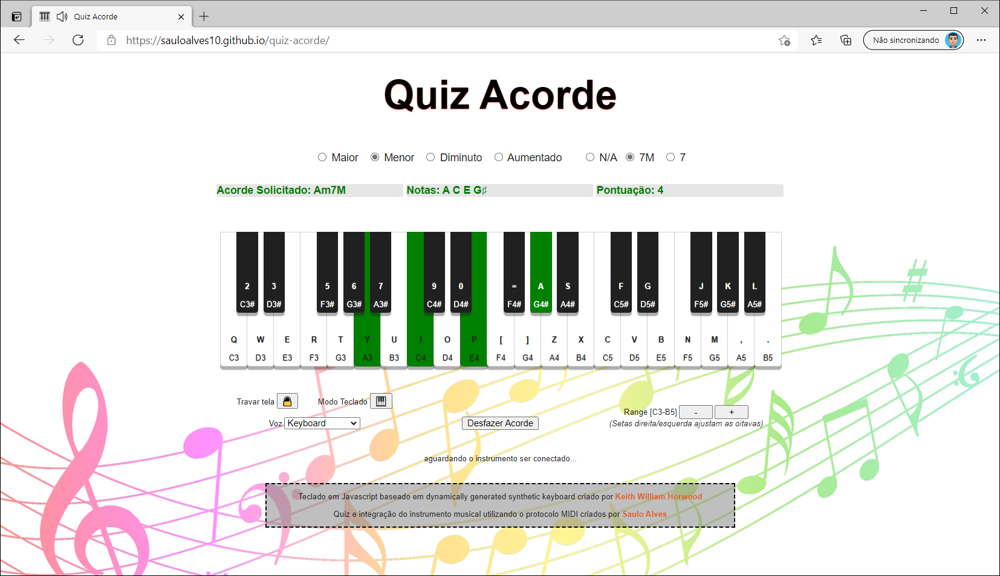
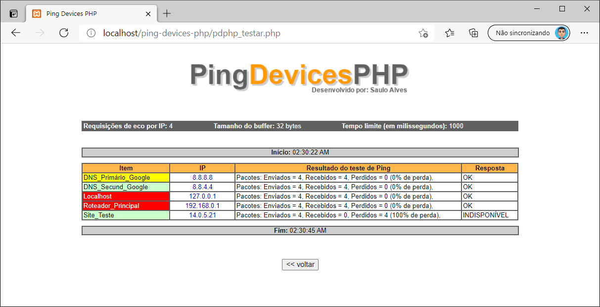

<h1 align="center"># Repositório público do Saulo Alves</h1>

Aqui você encontrará diversos projetos desenvolvidos em diversas linguagens de programação, espero que alguns deles possam te ajudar de alguma forma.

## Lotofácil Stats

Arquivo Excel com VBA que calcula e gera estatísticas sobre os resultados dos jogos da Lotofácil como média de dezenas sorteadas por jogo, porcentagem dos números sorteados, gráfico com a média de dezenas dos últimos 25 jogos, gerador de palpite, entre outros. 

* [Acesse o repositório com o arquivo .xlsm clicando aqui](https://github.com/SauloAlves10/lotofacil-stats)

## Quiz Acorde

Criado em HTML, Javascript e CSS, é um quiz dinâmico de acordes que te ajudará a memorizar os principais acordes de forma rápida e intuitiva, a aplicação conta com um teclado musical virtual mas também é possível conectar um teclado musical físico através do protocolo MIDI.

* [Acesse a aplicação clicando aqui](https://sauloalves10.github.io/quiz-acorde/)
* [Acesse o repositório com os arquivos HMTL 5 clicando aqui](https://github.com/SauloAlves10/quiz-acorde)

## Criptonum

Fruto de um trabalho de faculdade cujo o objetivo era criar um sistema de criptografia e descriptografia utilizando uma chave simétrica.

* [Acesse a aplicação clicando aqui](https://sauloalves10.github.io/criptonum/)
* [Acesse o repositório com os arquivos HTML 5 clicando aqui](https://github.com/SauloAlves10/criptonum)

## Ping Devices PHP

Desenvolvido com uma das linguangens de programação mais utilizadas no mundo e banco de Dados MySql, Ping Devices PHP é uma ferramenta simples e de fácil uso que te ajudará a realizar testes de ping em diversos devices em sequência, gerando uma lista com a nomenclatura dos itens, números de IPs, resultados dos testes de ping e se os itens estão disponíveis ou não.

* [Acesse o repositório com os arquivos PHP e SQL clicando aqui](https://github.com/SauloAlves10/ping-devices-php)

## Shut PC!

É uma poderosa ferramenta desenvolvida em AutoHotkey que permite agendar funções de desligar, reiniciar, logoff e hibernar para seu computador, além disso possui funções de agendamento de mensagens com alerta sonoro e inicialização com o Windows. Tudo é muito fácil e rápido com a utilização da interface gráfica da aplicação, programando as tarefas a serem executadas em questões segundos.

* [Acesse a versão com instalador clicando aqui](https://github.com/SauloAlves10/shut-pc/tree/main/Shut%20PC!%201.2%20Installer)
* [Acesse a versão portátil zipada clicando aqui](https://github.com/SauloAlves10/shut-pc/tree/main/Shut%20PC!%201.2%20Portable)
* [Acesse o repositório com os arquivos clicando aqui](https://github.com/SauloAlves10/shut-pc)

## Conquistas para o site RetroAchievements

Achievements do jogo Plaque Attack (Atari 2600) criados através da ferramenta RALibRetro que permite inspecionar a memória de jogos e programar condições para acionamento de conquistas. 

* [Acesse a página do jogo com a descrição dos achievements clicando aqui](https://retroachievements.org/game/13069)
* [Acesse o repositório com imagens, arquivos TXT e JSON clicando aqui](https://github.com/SauloAlves10/retroachievements/tree/main/plaque_attack_atari_2600)

Bom proveito!
